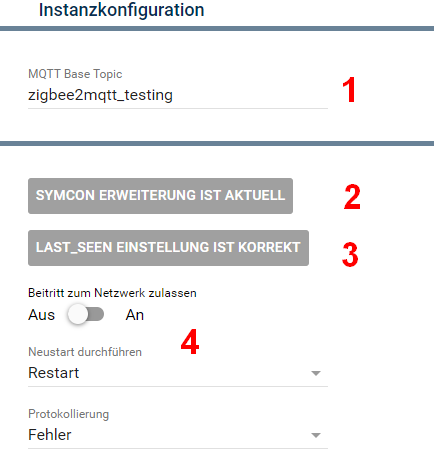

[](https://www.symcon.de/service/dokumentation/entwicklerbereich/sdk-tools/sdk-php/)

[](https://creativecommons.org/licenses/by-nc-sa/4.0/)  
[](https://github.com/Nall-chan/Zigbee2MQTT/actions)
[](https://github.com/Nall-chan/Zigbee2MQTT/actions)  

# Zigbee2MQTT-Bridge  <!-- omit in toc -->
   Modul für alle Systemweiten Funktionen von Zigbee2MQTT


## Inhaltsverzeichnis <!-- omit in toc -->

- [1. Funktionsumfang](#1-funktionsumfang)
- [2. Voraussetzungen](#2-voraussetzungen)
- [3. Software-Installation](#3-software-installation)
- [4. Konfiguration](#4-konfiguration)
- [5. Statusvariablen](#5-statusvariablen)
- [6. PHP-Funktionsreferenz](#6-php-funktionsreferenz)
- [7. Aktionen](#7-aktionen)
- [8. Anhang](#8-anhang)
  - [1. Changelog](#1-changelog)
  - [2. Spenden](#2-spenden)
  - [3. Lizenz](#3-lizenz)

## 1. Funktionsumfang

* Verfügbarkeit von Zigbee2MQTT in Symcon darstellen (Online-Variable)
* Verwaltung der für das Modul benötigten Extension in Zigbee2MQTT
* Systemweite Einstellungen in Zigbee2MQTT aus Symcon anpassen
* Netzwerkbeitritt aus Symcon steuern und darstellen
* Viele PHP-Funktionen um interne Zigbee2MQTT Funktionen auszuführen (Gruppen verwalten, Geräte umbenennen usw...)
  
## 2. Voraussetzungen

* mindestens IPS Version 7.0
* MQTT-Broker (interner MQTT-Server von Symcon oder externer z.B. Mosquitto)
* installiertes und lauffähiges [zigbee2mqtt](https://www.zigbee2mqtt.io) 
  
## 3. Software-Installation

* Dieses Modul ist Bestandteil der [Zigbee2MQTT-Library](../README.md#3-installation).  

## 4. Konfiguration

   
| **Nummer** | **Feld**            | **Beschreibung**                                                                                                                                                |
| ---------- | ------------------- | --------------------------------------------------------------------------------------------------------------------------------------------------------------- |
| **1**      | **MQTT Base Topic** | Dieses wird vom [Konfigurator](../Configurator/README.md) bei Anlage der Instanz automatisch auf den korrekten Wert gesetzt und sollte auch so belassen werden. |
| **2**      | **Erweiterung**     | Über diese Schaltfläche kann die Erweiterung in Z2M eingerichtet oder aktualisert werden, sofern dies nicht automatisch erfolgt ist.                            |
| **3**      | **last_seen**       | In Z2M muss die Einstellung `last_seen` auf den Wert `epoch` eingerichtet sein, da es sonst zu Fehlermeldungen bei den Variablen `Zuletzt gesehen` kommt.       |
| **4**      | **Testcenter**      | Hier sind die Schaltbaren Statusvariablen aufgeführt, so kann z.B. der Netzwerkbeitritt aktiviert werden.                                                       |

## 5. Statusvariablen

| Name                               | Typ     | Profil              | Beschreibung                                 |
| ---------------------------------- | ------- | ------------------- | -------------------------------------------- |
| Beitritt zum Netzwerk zulassen     | bool    | ~Switch             | Status und Steuern des Netzwerkbeitritt      |
| Erweiterung geladen                | bool    |                     | true wenn die Erweiterung geladen wurde      |
| Erweiterung ist aktuell            | bool    |                     | true wenn die Erweiterung aktuell ist        |
| Erweiterung Version                | string  |                     | Version der Erweiterung                      |
| Netzwerkkanal                      | integer |                     | Netzwerkkanal des Zigbee-Netzwerks           |
| Neustart durchführen               | integer | Z2M.bridge.restart  | Action Variable um einen Neustart auszulösen |
| Neustart erforderlich              | bool    |                     | true wenn eine Neustart von Z2M nötig ist    |
| Protokollierung                    | string  | Z2M.brigde.loglevel | Status der Softwareaktualisierung            |
| Status                             | bool    | ~Alert.Reversed     | Online Status von Zigbee2MQTT                |
| Version                            | string  |                     | Version von Zigbee2MQTT                      |
| Zigbee Herdsman Converters Version | string  |                     | Version des Zigbee Herdsman Converters       |
| Zigbee Herdsman Version            | string  |                     | Version vom Zigbee Herdsman-Modul            |

## 6. PHP-Funktionsreferenz

### Z2M_InstallSymconExtension <!-- omit in toc -->

```php
bool Z2M_InstallSymconExtension(int $InstanzID);
```
Die aktuelle Symcon Erweiterung wird in Z2M installiert.  

---
### Z2M_SetLastSeen <!-- omit in toc -->

```php
bool Z2M_SetLastSeen(int $InstanzID);
```
Die Konfiguration der `last_seen` Einstellung in Z2M wird auf `epoch` verändert, damit die Instanzen in Symcon den Wert korrekt darstellen können.  

---
### Z2M_SetPermitJoin <!-- omit in toc -->

```php
bool Z2M_SetPermitJoin(int $InstanzID, bool $PermitJoin);
```

---
### Z2M_SetLogLevel <!-- omit in toc -->

```php
bool Z2M_SetLogLevel(int $InstanzID, string $LogLevel);
```

---
### Z2M_Restart <!-- omit in toc -->

```php
bool Z2M_Restart(int $InstanzID);
```

---
### Z2M_CreateGroup <!-- omit in toc -->

```php
bool Z2M_CreateGroup(int $InstanzID, string $GroupName);
```

---
### Z2M_DeleteGroup <!-- omit in toc -->

```php
bool Z2M_DeleteGroup(int $InstanzID, string $GroupName);
```

---
### Z2M_RenameGroup <!-- omit in toc -->

```php
bool Z2M_RenameGroup(int $InstanzID, string $OldName, string $NewName);
```

---
### Z2M_AddDeviceToGroup <!-- omit in toc -->

```php
bool Z2M_AddDeviceToGroup(int $InstanzID, string $GroupName, string $DeviceName);
```

---
### Z2M_RemoveDeviceFromGroup <!-- omit in toc -->

```php
bool Z2M_RemoveDeviceFromGroup(int $InstanzID, string $GroupName, string $DeviceName);
```

---
### Z2M_RemoveAllDevicesFromGroup <!-- omit in toc -->

```php
bool Z2M_RemoveAllDevicesFromGroup(int $InstanzID, string $GroupName);
```

---
### Z2M_Bind <!-- omit in toc -->

```php
bool Z2M_Bind(int $InstanzID, string $SourceDevice, string $TargetDevice);
```

---
### Z2M_Unbind <!-- omit in toc -->

```php
bool Z2M_Unbind(int $InstanzID, string $SourceDevice, string $TargetDevice);
```

---
### Z2M_RequestNetworkmap <!-- omit in toc -->

```php
bool Z2M_RequestNetworkmap(int $InstanzID);
```

---
### Z2M_RenameDevice <!-- omit in toc -->

```php
bool Z2M_RenameDevice(int $InstanzID, string $OldDeviceName, string $NewDeviceName);
```

---
### Z2M_RemoveDevice <!-- omit in toc -->

```php
bool Z2M_RemoveDevice(int $InstanzID, string $DeviceName);
```

---
### Z2M_CheckOTAUpdate <!-- omit in toc -->

```php
bool Z2M_CheckOTAUpdate(int $InstanzID, string $DeviceName);
```

---
### Z2M_PerformOTAUpdate <!-- omit in toc -->

```php
bool Z2M_PerformOTAUpdate(int $InstanzID, string $DeviceName);
```

## 7. Aktionen

Keine Aktionen verfügbar.

## 8. Anhang

### 1. Changelog

[Changelog der Library](../README.md#5-changelog)

### 2. Spenden

Dieses Modul ist für die nicht kommerzielle Nutzung kostenlos, Schenkungen als Unterstützung für den Autor werden hier akzeptiert:

<a href="https://www.paypal.com/cgi-bin/webscr?cmd=_s-xclick&hosted_button_id=EK4JRP87XLSHW" target="_blank"></a> <a href="https://www.amazon.de/hz/wishlist/ls/3JVWED9SZMDPK?ref_=wl_share" target="_blank">Amazon Wunschzettel</a>

### 3. Lizenz

[CC BY-NC-SA 4.0](https://creativecommons.org/licenses/by-nc-sa/4.0/)