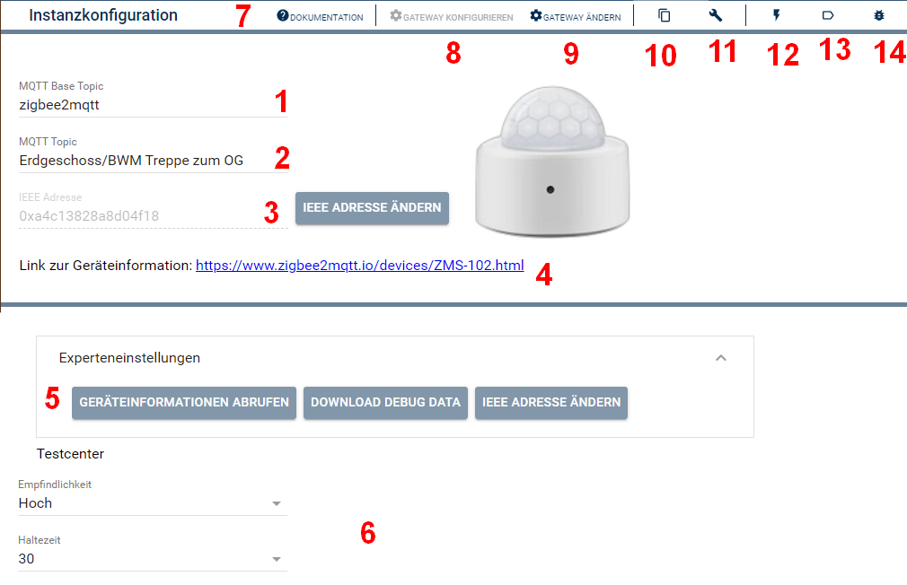
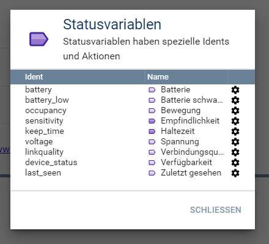
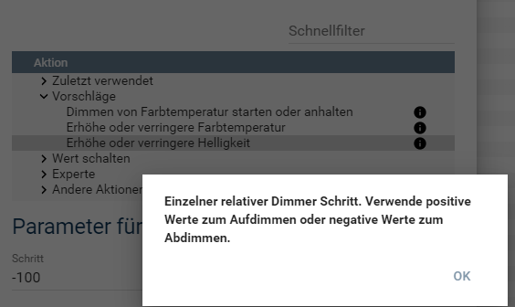

[](https://www.symcon.de/service/dokumentation/entwicklerbereich/sdk-tools/sdk-php/)

[](https://creativecommons.org/licenses/by-nc-sa/4.0/)  
[](https://github.com/Nall-chan/Zigbee2MQTT/actions)
[](https://github.com/Nall-chan/Zigbee2MQTT/actions)  

# Zigbee2MQTT-Gerät  <!-- omit in toc -->
   Mit diesem Module werden die Geräte von Zigbee2MQTT in IP-Symcon als Instanz abgebildet

## Inhaltsverzeichnis <!-- omit in toc -->
- [1. Funktionsumfang](#1-funktionsumfang)
- [2. Voraussetzungen](#2-voraussetzungen)
- [3. Software-Installation](#3-software-installation)
- [4. Konfiguration](#4-konfiguration)
- [5. Statusvariablen](#5-statusvariablen)
- [6. PHP-Funktionsreferenz](#6-php-funktionsreferenz)
- [7. Aktionen](#7-aktionen)
- [8. Anhang](#8-anhang)
  - [1. Changelog](#1-changelog)
  - [2. Spenden](#2-spenden)
  - [3. Lizenz](#3-lizenz)

   
## 1. Funktionsumfang

* Darstellung aller von Z2M gelieferten Werte in Symcon
* Inklusive der Verfügbarkeit des Gerätes als Variable (Online-Variable), wenn dies in Z2M aktiviert ist: [availability](https://www.zigbee2mqtt.io/guide/configuration/device-availability.html).
* Automatisches Erstellern der für die Variablen benötigten Variablenprofile gemäß den Daten aus Z2M
* Erstellen von Variablen für reine Aktionen wie Voreinstellungen wählen, Effekte aufrufen oder Identifizieren starten
  
## 2. Voraussetzungen

* mindestens IPS Version 7.0
* MQTT-Broker (interner MQTT-Server von Symcon oder externer z.B. Mosquitto)
* installiertes und lauffähiges [zigbee2mqtt](https://www.zigbee2mqtt.io) 
  
## 3. Software-Installation

* Dieses Modul ist Bestandteil der [Zigbee2MQTT-Library](../README.md#3-installation).  

## 4. Konfiguration

   
| **Nummer** | **Feld**                        | **Beschreibung**                                                                                                                                                                                                                                                                                                                                                                                                                                                                                                                                                                                                                                      |
| ---------- | ------------------------------- | ----------------------------------------------------------------------------------------------------------------------------------------------------------------------------------------------------------------------------------------------------------------------------------------------------------------------------------------------------------------------------------------------------------------------------------------------------------------------------------------------------------------------------------------------------------------------------------------------------------------------------------------------------- |
| **1**      | **MQTT Base Topic**             | Dieses wird vom [Konfigurator](../Configurator/README.md) bei Anlage der Instanz automatisch auf den korrekten Wert gesetzt und sollte auch so belassen werden.                                                                                                                                                                                                                                                                                                                                                                                                                                                                                       |
| **2**      | **MQTT Topic**                  | Das Topic, welches die Instanz in Z2M nutzt. Beim Anlernen von Geräten an Z2m erhält jedes Gerät einen Namen (`friendly_name`). Standard ist hier die IEEE-Adresse. Dies kann im Nachgang aber geändert werden.<br>**Bei jeder Änderung des Namen ändert sich auch das Topic in MQTT.**<br>Entsprechend muss das neue Topic in Symcon übernommen werden. Dies kann per Hand, oder über den [Konfigurator](../Configurator/README.md) erfolgen (Prüfen Button), welcher geänderte Topics anhand der Geräte IEEE Adresse erkennt.                                                                                                                       |
| **3**      | **IEEE Adresse**                | Anhand dieser Adresse ist, unabhängig vom Topic, eine eindeutige Identifikation von Geräten in Z2M möglich. **Die IEEE Adresse sollte nicht geändert werden!** Ausnahme wäre der 1:1 Austausch von einem baugleichen Gerät, so muss die Instanz in Symcon nicht gelöscht und neu angelegt werden.                                                                                                                                                                                                                                                                                                                                                     |
| **4**      | **Geräteinformationen**         | Hier wird der Link zum Gerät in der Z2M Doku angezeigt und das entsprechende Bild von dem Gerät. Die Bilder werden von Z2M bereit gestellt und können teilweise abweichen.                                                                                                                                                                                                                                                                                                                                                                                                                                                                            |
| **5**      | **Geräteinformationen abrufen** | Über diesen Button können alle Informationen zu einem Gerät aus Z2M erneut abgerufen werden. Dies ist manchmal notwendig, wenn das Gerät bezüglich der betreffenden Daten (exposes) aus Z2M ein Update erhalten hat (z.B. neue Effekte oder zusätzliche Datenpunkte). Beim Anlegen der Instanz wird dies automatisch durchgeführt.                                                                                                                                                                                                                                                                                                                            |
| **6**      | **Testcenter**                  | Hier werden alle Statusvariablen der Instanz welche bedienbar (steuerbar) sind von der Konsole dargestellt. Somit ist ein Funktionstest schnell möglich.                                                                                                                                                                                                                                                                                                                                                                                                                                                                                              |
| **7**      | **Dokumentaion**                | Direkter zugriff auf die Dokumentation der Instanz.                                                                                                                                                                                                                                                                                                                                                                                                                                                                                                                                                                                                   |
| **8**      | **Gateway konfigurieren**       | Unter diesem Punkt kann der verbundene MQTT-Splitter (Client oder Server) aufgerufen werden.                                                                                                                                                                                                                                                                                                                                                                                                                                                                                                                                                          |
| **9**      | **Gateway ändern**              | Dient zur Auswahl des von der Instanz genutzten MQTT-Splitters (Client oder Server).  Wird beim anlegen von Geräten über den [Konfigurator](../Configurator/README.md) automatisch gesetzt und kann auch über diese Korrigert werden.                                                                                                                                                                                                                                                                                                                                                                                                                 |
| **10**     | **InstanzID kopieren**          | Kopiert die Instanz ID in die Zwischenablage.                                                                                                                                                                                                                                                                                                                                                                                                                                                                                                                                                                                                         |
| **11**     | **Instanzobjekt bearbeiten**    | Öffnet den gleichen Dialog wie im Objektbaum unter `Instanz bearbeiten`.                                                                                                                                                                                                                                                                                                                                                                                                                                                                                                                                                                              |
| **12**     | **Ereignisse**                  | Zeigt eine Übersicht, welche Ereignisse mit der Instanz verbunden sind. Über den Button Neu lassen sich neue Ereignisse zu der Instanz einrichten (Ausgelöst, zyklisch oder per Wochenplan). Die zugehörigen Eregnisse können direkt bearbeitet werden.                                                                                                                                                                                                                                                                                                                                                                 |
| **13**     | **Statusvariablen**             | Hier lassen sich alle der Instanz zugehörigen Variablen bearbeiten                                                                                                                                                                                                                                                                                                                                                                                                                                                                                                                                                    |
| **14**     | **Debug**                       | Öffnet eine Debug-Ausgabe dieser Instanz. Protokolle der Debug-Augabe werden im Fehlerfall von den Entwicklern abgefragt. Da hier u.a. auch zu sehen ist, ob Werte des MQTT-Expose oder Payload nicht zugeordnet werden können, Profile fehlen, Schaltaktionen nicht ausgeführt wurden können usw...<br>Sollte es Probleme mit einer Instanz geben, können diese nur adäquat bearbeitet werden, wenn der Meldung (unter Issues oder im Forum) ein Debug beigelegt wird. Dazu bitte im Debug-Fenster zuerst das Limit ausschalten und später über  die heruntergeladene Debug-Datei der Meldung im Forum beifügen. |

## 5. Statusvariablen

Die Statusvariablen werden je nach Funktion und Fähigkeiten der Geräte dynamisch erstellt.  

## 6. PHP-Funktionsreferenz

   ```php
   RequestAction($VariablenID, $Value);
   ```
   Mit dieser Funktion können alle Aktionen einer Variable ausgelöst werden.

   **Beispiel:**

   Variable ID Status: 12345
   ```php
   RequestAction(12345, true); //Einschalten
   RequestAction(12345, false); //Ausschalten
   ```

---

   ```php
   Z2M_Command(string $topic, string $value)
   ```
   Mit dies Funktion kann ein belibiger Payload (Datensatz) an das Gerät (Geräte-Topic) gesendet werden.

   **Beispiel:**

   ```php
   $Payload['brightness_step_onoff'] = 10;
   Z2M_Command('set', json_encode($Payload));
   ```
   Sendet `brightness_step_onoff` mit dem Wert 10 an das Gerät, welches entsprechend die Helligkeit um den Rohwert 10 erhöht und, falls es vorher ausgeschaltet war, eingeschaltet wird.

---

   ```php
   Z2M_CommandEx(string $fulltopic, string $value)
   ```
   Mit dies Funktion kann ein belibiger Payload (Datensatz) an Z2M gesendet werden.

   **Beispiel:**

   ```php
   $Payload['state'] = '';
   Z2M_CommandEx('Keller/Lampe1/get', json_encode($Payload));
   ```

   Dieses Beispiel ruft `state` von `{BaseTopic}Keller/Lampe1` ab.
   
## 7. Aktionen

__Grundsätzlich können alle bedienbaren Statusvariablen als Ziel einer [`Aktion`](https://www.symcon.de/service/dokumentation/konzepte/automationen/ablaufplaene/aktionen/) mit 'Auf Wert schalten' angesteuert werden, so das hier keine speziellen Aktionen benutzt werden müssen.__

**Zusätzlich** gibt es Sonderfunktionen in Form von speziellen Aktionen, welche für die Zigbee2MQTT-Geräte und Gruppen Instanzen zur Verfügung stehen, wenn diese als Ziel einer Aktion ausgewählt wurden.

Die möglichen Aktionen werden anhand der Statusvariablen der Instanz angeboten, somit sind nicht alle Aktionen immer verfügbar.  
Über das `i` hinter einer Aktion kann eine Erklärung der Aktion angezeigt werden.
Hier als Beispiel das Schrittweise auf/abdimmen.  

 

Liste aller Aktionen:

| Funktion                            | Vorraussetzung (Variable) |
| :---------------------------------- | :------------------------ |
| Einchaltverzögerung                 | Countdown                 |
| Auschaltverzögerung                 | Countdown                 |
| Helligkeit mit Übergangszeit        | Helligkeit                |
| Dimmen der Helligkeit (absolut)     | Helligkeit                |
| Dimmen der Helligkeit (relativ)     | Helligkeit                |
| Dimmen der Farbtemperatur (absolut) | Farbtemepatur             |
| Dimmen der Farbtemperatur (relativ) | Farbtemepatur             |
| Farbe mit Übergangszeit             | Farbe                     |

## 8. Anhang

### 1. Changelog

[Changelog der Library](../README.md#5-changelog)

### 2. Spenden

Dieses Modul ist für die nicht kommerzielle Nutzung kostenlos, Schenkungen als Unterstützung für den Autor werden hier akzeptiert:

<a href="https://www.paypal.com/cgi-bin/webscr?cmd=_s-xclick&hosted_button_id=EK4JRP87XLSHW" target="_blank"></a> <a href="https://www.amazon.de/hz/wishlist/ls/3JVWED9SZMDPK?ref_=wl_share" target="_blank">Amazon Wunschzettel</a>

### 3. Lizenz

[CC BY-NC-SA 4.0](https://creativecommons.org/licenses/by-nc-sa/4.0/)
