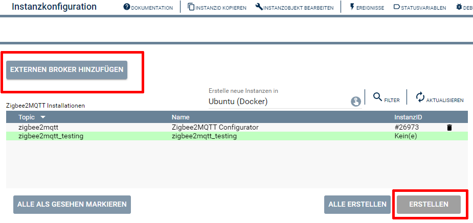
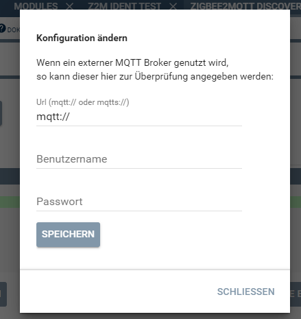

  

  

# Zigbee2MQTT-Discovery <!-- omit in toc -->
Mit dieser Instanz werden alle mit MQTT-Brokern(Servern) verbundenen Zigbee2MQTT Installationen erkannt.

## Inhaltsverzeichnis <!-- omit in toc -->
- [1. Voraussetzungen](#1-voraussetzungen)
- [2. Software-Installation](#2-software-installation)
- [3. Verwendung der Instanzen](#3-verwendung-der-instanzen)
- [4. Statusvariablen](#4-statusvariablen)
- [5. PHP-Funktionsreferenz](#5-php-funktionsreferenz)
- [6. Aktionen](#6-aktionen)
- [7. Anhang](#7-anhang)
  - [1. Changelog](#1-changelog)
  - [2. Spenden](#2-spenden)
  - [3. Lizenz](#3-lizenz)

## 1. Voraussetzungen

* mindestens IPS Version 7.0
* MQTT-Broker (interner MQTT-Server von Symcon oder externer z.B. Mosquitto)
* installiertes und lauffähiges [zigbee2mqtt](https://www.zigbee2mqtt.io) 
  
## 2. Software-Installation

* Dieses Modul ist Bestandteil der [Zigbee2MQTT-Library](../README.md#3-installation).  

## 3. Verwendung der Instanzen

 Beim Öffnen der Instanz wird automatisch ein Suchlauf an allen in Symcon eingerichteten MQTT Clients und Server gestartet.   
 Alternativ kann ein externer Broker manuell angegeben werden.  

Wird eine Zeile selektiert und die Schaltfläche `Erstellen` betätigt, so wird automatisch eine [Konfigurator](../Configurator/README.md)-Instanz, und bei Angabe eines externen Brokern auch der benötigten MQTT-Client mit  Client Socket, in Symcon angelegt.  

Über den Button `Konfigurieren` wird die weitere Konfiguration in der [Konfigurator](../Configurator/README.md)-Instanz fortgesetzt. 

## 4. Statusvariablen

Dieses Modul erzeugt keine Statusvariablen.  

## 5. PHP-Funktionsreferenz

Keine Funktionen verfügbar.  

## 6. Aktionen

Keine Aktionen verfügbar.

## 7. Anhang

### 1. Changelog

[Changelog der Library](../README.md#5-changelog)

### 2. Spenden

Dieses Modul ist für die nicht kommerzielle Nutzung kostenlos, Schenkungen als Unterstützung für den Autor werden hier akzeptiert:

 <a href="https://www.amazon.de/hz/wishlist/ls/3JVWED9SZMDPK?ref_=wl_share" target="_blank">Amazon Wunschzettel</a>

### 3. Lizenz

[CC BY-NC-SA 4.0](https://creativecommons.org/licenses/by-nc-sa/4.0/)
