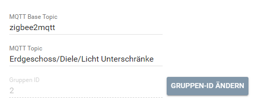

[](https://www.symcon.de/service/dokumentation/entwicklerbereich/sdk-tools/sdk-php/)

[](https://creativecommons.org/licenses/by-nc-sa/4.0/)  
[](https://github.com/Nall-chan/Zigbee2MQTT/actions)
[](https://github.com/Nall-chan/Zigbee2MQTT/actions)  

# Zigbee2MQTT-Gruppen  <!-- omit in toc -->
   Mit diesem Modul werden die Gruppen von Zigbee2MQTT in IP-Symcon als Instanz abgebildet

## Inhaltsverzeichnis <!-- omit in toc -->
- [1. Funktionsumfang](#1-funktionsumfang)
- [2. Voraussetzungen](#2-voraussetzungen)
- [3. Software-Installation](#3-software-installation)
- [4. Konfiguration](#4-konfiguration)
  - [4.1 Gruppen in Z2M](#41-gruppen-in-z2m)
  - [4.2 Konfiguration](#42-konfiguration)
- [5. Statusvariablen](#5-statusvariablen)
- [6. PHP-Funktionsreferenz](#6-php-funktionsreferenz)
- [7. Aktionen](#7-aktionen)
- [8. Anhang](#8-anhang)
  - [1. Changelog](#1-changelog)
  - [2. Spenden](#2-spenden)
  - [3. Lizenz](#3-lizenz)

## 1. Funktionsumfang

* Darstellung aller von Z2M gelieferten Werten der Gruppe in Symcon
* Automatisches Erstellern der für die Variablen benötigten Variablenprofile gemäß den Daten aus Z2M
  
## 2. Voraussetzungen

* mindestens IPS Version 7.0
* MQTT-Broker (interner MQTT-Server von Symcon oder externer z.B. Mosquitto)
* installiertes und lauffähiges [zigbee2mqtt](https://www.zigbee2mqtt.io) 
  
## 3. Software-Installation

* Dieses Modul ist Bestandteil der [Zigbee2MQTT-Library](../README.md#3-installation).  

## 4. Konfiguration

   ### 4.1 Gruppen in Z2M  

   In Z2M gibt es die Möglichkeit, Geräte in Gruppen zusammen zu fassen und diese dann wie ein einzelnes Gerät zu steuern. Sinn macht Dies zum Beispiel, wenn man mehrere Leuchtmittel als eine Gerät ansprechen will:
     

   Hier als Beispiel die Gruppe `Bad/Beleuchtung/Deckenlicht`:  

   

   Genauere Informationen gibt es direkt auf der Seite von Zigbee2mqtt: https://www.zigbee2mqtt.io/guide/configuration/devices-groups.html  

   **Wichtig:**  
   Bitte die Themen in der Z2M-Anleitung genauestens lesen. In Gruppen können nicht alle Eigenschaften der enthaltenen Geräte bedient werden. Zusätzlich lassen sich über Z2M noch Szenen erstellen, welche den Gruppen oder einzelnen Geräten zugeordnet werden können.  

   **Das Handling von Gruppen in Symcon ist dem der einzelnen Geräte gleich.**

   ### 4.2 Konfiguration

   Die Konfiguration entspricht dem der einzelenen [Zigbee2MQTT-Geräte](../Device/README.md#4-konfiguration), mit der Außnahme das die IEEE-Adresse durch die Gruppen-Adresse ersetzt ist und es keine Geräte-Informationen gibt.

     
                                                                                                                                                       |
## 5. Statusvariablen

   Die Statusvariablen werden je nach Funktion und Fähigkeiten der Geräte dynamisch erstellt.  

## 6. PHP-Funktionsreferenz

   ```php
   RequestAction($VariablenID, $Value);
   ```
   Mit dieser Funktion können alle Aktionen einer Variable ausgelöst werden.

   **Beispiel:**

   Variable ID Status: 12345
   ```php
   RequestAction(12345, true); //Einschalten
   RequestAction(12345, false); //Ausschalten
   ```

---

   ```php
   Z2M_Command(string $topic, string $value)
   ```
   Mit dies Funktion kann ein belibiger Payload (Datensatz) an das Gerät (Geräte-Topic) gesendet werden.

   **Beispiel:**

   ```php
   $Payload['brightness_step_onoff'] = 10;
   Z2M_Command('set', json_encode($Payload));
   ```
   Sendet `brightness_step_onoff` mit dem Wert 10 an das Gerät, welches entsprechend die Helligkeit um den Rohwert 10 erhöht und, falls es vorher ausgeschaltet war, eingeschaltet wird.

---

   ```php
   Z2M_CommandEx(string $fulltopic, string $value)
   ```
   Mit dies Funktion kann ein belibiger Payload (Datensatz) an Z2M gesendet werden.

   **Beispiel:**

   ```php
   $Payload['state'] = '';
   Z2M_CommandEx('Keller/Lampe1/get', json_encode($Payload));
   ```

   Dieses Beispiel ruft `state` von `{BaseTopic}Keller/Lampe1` ab.
   
## 7. Aktionen

__Grundsätzlich können alle bedienbaren Statusvariablen als Ziel einer [`Aktion`](https://www.symcon.de/service/dokumentation/konzepte/automationen/ablaufplaene/aktionen/) mit 'Auf Wert schalten' angesteuert werden, so das hier keine speziellen Aktionen benutzt werden müssen.__

**Zusätzlich** gibt es Sonderfunktionen in Form von speziellen Aktionen, welche für die Zigbee2MQTT-Geräte und Gruppen Instanzen zur Verfügung stehen, wenn diese als Ziel einer Aktion ausgewählt wurden.

Die möglichen Aktionen werden anhand der Statusvariablen der Instanz angeboten, somit sind nicht alle Aktionen immer verfügbar.  
Über das `i` hinter einer Aktion kann eine Erklärung der Aktion angezeigt werden.
Hier als Beispiel das Schrittweise auf/abdimmen.  

 

Liste aller Aktionen:

| Funktion                            | Vorraussetzung (Variable) |
| :---------------------------------- | :------------------------ |
| Einchaltverzögerung                 | Countdown                 |
| Auschaltverzögerung                 | Countdown                 |
| Helligkeit mit Übergangszeit        | Helligkeit                |
| Dimmen der Helligkeit (absolut)     | Helligkeit                |
| Dimmen der Helligkeit (relativ)     | Helligkeit                |
| Dimmen der Farbtemperatur (absolut) | Farbtemepatur             |
| Dimmen der Farbtemperatur (relativ) | Farbtemepatur             |
| Farbe mit Übergangszeit             | Farbe                     |

## 8. Anhang

### 1. Changelog

[Changelog der Library](../README.md#5-changelog)

### 2. Spenden

Dieses Modul ist für die nicht kommerzielle Nutzung kostenlos, Schenkungen als Unterstützung für den Autor werden hier akzeptiert:

<a href="https://www.paypal.com/cgi-bin/webscr?cmd=_s-xclick&hosted_button_id=EK4JRP87XLSHW" target="_blank"></a> <a href="https://www.amazon.de/hz/wishlist/ls/3JVWED9SZMDPK?ref_=wl_share" target="_blank">Amazon Wunschzettel</a>

### 3. Lizenz

[CC BY-NC-SA 4.0](https://creativecommons.org/licenses/by-nc-sa/4.0/)