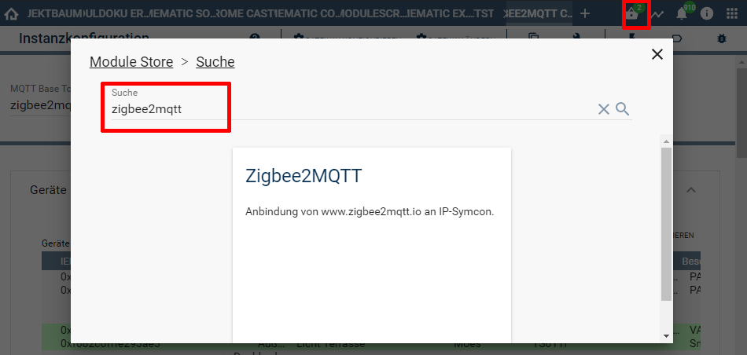
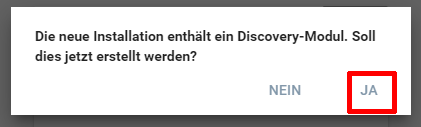

  

  

# Zigbee2MQTT  <!-- omit in toc -->
Anbindung von [zigbee2mqtt](https://www.zigbee2mqtt.io) an IP-Symcon.

## Inhaltsverzeichnis  <!-- omit in toc -->

- [1. Voraussetzungen](#1-voraussetzungen)
- [2. Enthaltene Module](#2-enthaltene-module)
- [3. Installation](#3-installation)
  - [3.1 Neuinstallation](#31-neuinstallation)
  - [3.2 Update von Modul Version 4.5 auf 5.x](#32-update-von-modul-version-45-auf-5x)
  - [3.3 Installation der IP-Symcon Extension in Zigbee2MQTT](#33-installation-der-ip-symcon-extension-in-zigbee2mqtt)
- [4. Konfiguration in IP-Symcon](#4-konfiguration-in-ip-symcon)
- [5. Changelog](#5-changelog)
- [6. Spenden](#6-spenden)
- [7. Lizenz](#7-lizenz)

## 1. Voraussetzungen

* mindestens IPS Version 7.0
* MQTT-Broker (interner MQTT-Server von Symcon oder externer z.B. Mosquitto)
* installiertes und lauffähiges [zigbee2mqtt](https://www.zigbee2mqtt.io) 

## 2. Enthaltene Module

* [Zigbee2MQTT Discovery](Discovery/README.md)
* [Zigbee2MQTT Konfigurator](Configurator/README.md)
* [Zigbee2MQTT Bridge](Bridge/README.md)
* [Zigbee2MQTT Gerät](Device/README.md)
* [Zigbee2MQTT Gruppe](Group/README.md)

 Details zu jedem Typ sind direkt in der Dokumentation der jeweiligen Module beschrieben.

## 3. Installation

### 3.1 Neuinstallation  

Zuerst ist eine funktionierende Zigbee2MQTT Umgebung gemäß der [Installationsanleitung von Zigbee2MQTT (Link)](https://www.zigbee2mqtt.io/guide/getting-started/) einzurichten.

Ein hierfür benötigter MQTT-Broker ist in Symcon verfügbar und muss entsprechend **vorher** [in Symcon als Instanz erstellt werden (Link)](https://www.symcon.de/de/service/dokumentation/modulreferenz/mqtt/mqtt-server/), sofern er nicht schon vorhanden ist.
Ein MQTT-Konfigurator wird für Zigbee2MQTT nicht benötigt!

Die Installation des Zigbee2MQTT Moduls erfolgt anschließend über den Module Store in der Symcon Konsole.
  

Nach der Installation fragt die Konsole ob eine [Zigbee2MQTT-Discovery](Discovery/README.md)-Instanz erstellt werden soll.  
  

Weitere Schritte zur Ersteinrichtung sind unter dem [Zigbee2MQTT-Discovery](Discovery/README.md)-Modul beschrieben.  

---

### 3.2 Update von Modul Version 4.5 auf 5.x

 ### Achtung  <!-- omit in toc -->

**Bitte diese Migrationsanleitung genau lesen und beachten, ein downgrade auf eine alte Modul Version ist nur mit einem Symcon-Backup möglich!**

  ### I. Vorbereitung <!-- omit in toc -->

- Bevor das Update über den Modul-Store durchgeführt werden kann, ist sicherzustellen das zuvor mindestens die Version 4.6 der [Extension in Zigbee2MQTT](#33-installation-der-ip-symcon-extension-in-zigbee2mqtt) installiert ist.
-  Diese wird automatisch ab Version 4.5 durch die [Bridge-Instanz](Bridge/README.md)  installiert, sofern diese Instanz angelegt wurde.
- Alternativ muss die benötigte [Extension in Zigbee2MQTT](#33-installation-der-ip-symcon-extension-in-zigbee2mqtt) manuell ein Update auf Version 4.6 erhalten.

**Ohne aktuelle Extension wird das Modul Update mit Fehlermeldungen durchgeführt, welche zu unerwarteten Fehlverhalten führen kann**

### II. Modul-Update <!-- omit in toc -->

- Während des Updates wird empfohlen das Fenster [Meldungen](https://www.symcon.de/de/service/dokumentation/komponenten/verwaltungskonsole/meldungen/) geöffnet zu lassen um eventuelle Fehlermeldungen nachvollziehen zu können.  
- Das Update anschließend über den [Modul-Store](https://www.symcon.de/de/service/dokumentation/komponenten/verwaltungskonsole/module-store/) durchführen.

#### geänderte Variablen-Idents <!-- omit in toc -->  

- Die Version 5.0 ändert beim Update alle Ident aller Variablen welche zu einer ZigbeeMQTT-Instanz gehören.
- Diese Änderung betritt nur User welche mit Scripten auf Variablen per Ident (z.B. Z2M_Brightness) und nicht per ObjektID (z.B. 12345) zugreifen.
- Die Variablen selbst bleiben dabei erhalten, so das sich hier keine ObjektIDs ändern, und entsprechen auch keine Änderungen an Ereignissen, Links, Automationen etc... ergeben.  

### 3. Zigbee2MQTT Version <!-- omit in toc -->

- Ein Update auf Zigbee2MQTT Version 2.0 oder neuer kann nach dem Update des Moduls durchgeführt werden.  
- Hierzu sind die Anleitungen unter [zigbee2mqtt.io](https://www.zigbee2mqtt.io/guide/installation/) zu beachten.
- In Symcon sollte eine [Bridge-Instanz](Bridge/README.md) eingerichtet sein, damit beim Update automatisch die korrekte [Extension in Zigbee2MQTT](#33-installation-der-ip-symcon-extension-in-zigbee2mqtt) installiert wird.  

---

### 3.3 Installation der IP-Symcon Extension in Zigbee2MQTT

Für den fehlerfreien Betrieb des Moduls wird eine Erweiterung (Extension) in Zigbee2MQTT benötigt.

**Folgende Varianten zum Einreichten der Erweiterung sind möglich:**  

**1.** Über die [Bridge](Bridge/README.md)-Instanz in Symcon (empfohlen)  

**2.** Über das Z2M Frontend den Inhalt der passenden Datei unter dem Menüpunkt Erweiterungen hinzufügen.  

**3.** Die passende Datei in das der Z2M Version entsprechende Verzeichnis auf dem Rechner, wo Z2M installiert ist ablegen. (Expertenwissen zu Z2M erforderlich)

Extension-Dateien und Pfade innerhalb Z2M:

- **Z2M bis Version 1.42**  
  - [IPSymconExtension.js](libs/IPSymconExtension.js)
  - Z2M Pfad: **`data/extension`**
- **Z2M ab Version 2.0**  
  - [IPSymconExtension2.js](libs/IPSymconExtension2.js)
  - Z2M Pfad: **`data/external_extensions`**  

**Anleitungen zum Einreichten der Erweiterung:**  

**zu 1.** Ist in der Dokumentation der [Bridge](Bridge/README.md)-Instanz beschrieben.  

**zu 2.** Das Frontend von Z2M im Browser öffnen und den Punkt "Erweiterungen" wählen.  

     
   Eine neue Extension über den Plus-Button anlegen:  
     
   Der Erweiterung einen Namen geben, z.B. symcon.js:  
     
   Es öffnet sich ein Fenster für die Code-Eingabe:  
     
   Den dort bereits enthaltenen Code bitte **komplett** löschen.  
   Anschließend den Inhalt (Code) aus  
   [IPSymconExtension.js für Z2M bis Version 1.42](libs/IPSymconExtension.js)  
   oder  
   [IPSymconExtension.js für Z2M ab Version 2.0](libs/IPSymconExtension2.js)  
   einfügen und speichern.  
   Danach sollte Z2M neu gestartet werden:  
     

**zu 3.** Sollte nur von versierten Usern gemacht werden, da es aufgrund der vielzahl an Systemen unter welchen Z2M laufen kann, keine global gültige Anleitung gibt.  

## 4. Konfiguration in IP-Symcon
Bitte den einzelnen Modulen entnehmen:

* [Bridge](Bridge/README.md)
* [Configurator](Configurator/README.md)
* [Device](Device/README.md)
* [Group](Group/README.md)

## 5. Changelog  

**Version 5.0:**  
- Kompatibilität mit Zigbee2MQTT Version 2.0 hergestellt  
- Geräte erkennen automatisch die Features und Exposes und erstellen die benötigten Variablen mit den entsprechenden Profilen eigenständig  
  -  Somit keine missing exposes Debugs mehr nötig!  
- Nutzung von Standard-Symcon Profilen, soweit möglich  
- Presets und Effekte als Variablen verfügbar  
- Geräte speichern die IEEE um umbenannte Geräte (= geändertes Topic) zu erkennen
- Z2M Prefix bei VariablenIdents entfernt    
- Konfigurator übernimmt die MQTT Topic-Struktur beim Anlegen von Geräten als Kategorien  
- Konfigurator erkennt fehlende Bridge-Instanz  
- Konfigurator erkennt falsche Topics (anhand der IEEE Adresse der Geräte)  
- Bridge installiert die Extension nicht mehrfach  
- Bridge installiert automatisch die benötigte Extension  
- Komplettes Code-Rework für Geräte und Gruppen von Bruki24
- Diverse Aktionen für die Instanzen der Geräte und Gruppen:  
  - Relatives Dimmen der Helligkeit  
  - Schrittweises Dimmen der Helligkeit  
  - Relatives Dimmen der Farbtemperatur  
  - Schrittweises Dimmen der Farbtemperatur  
  - Ein-/Ausschaltverzögerung  
  
## 6. Spenden

Dieses Modul ist für die nicht kommerzielle Nutzung kostenlos, Schenkungen als Unterstützung für den Autor werden hier akzeptiert:

 <a href="https://www.amazon.de/hz/wishlist/ls/3JVWED9SZMDPK?ref_=wl_share" target="_blank">Amazon Wunschzettel</a>

## 7. Lizenz

[CC BY-NC-SA 4.0](https://creativecommons.org/licenses/by-nc-sa/4.0/)
