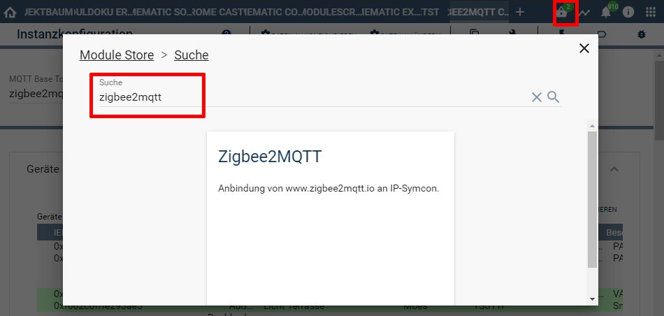
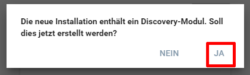
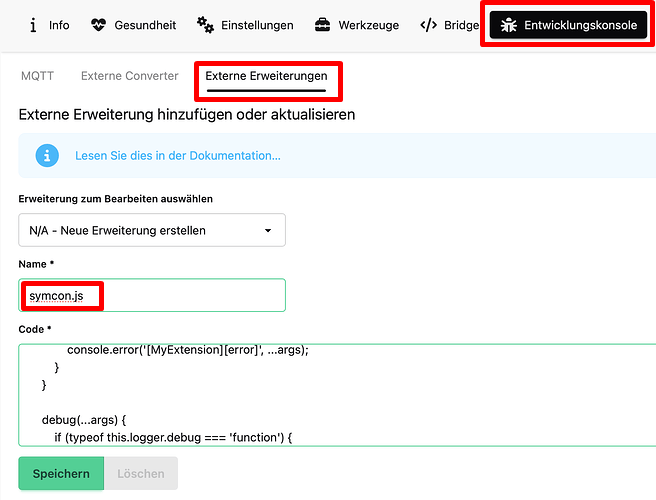
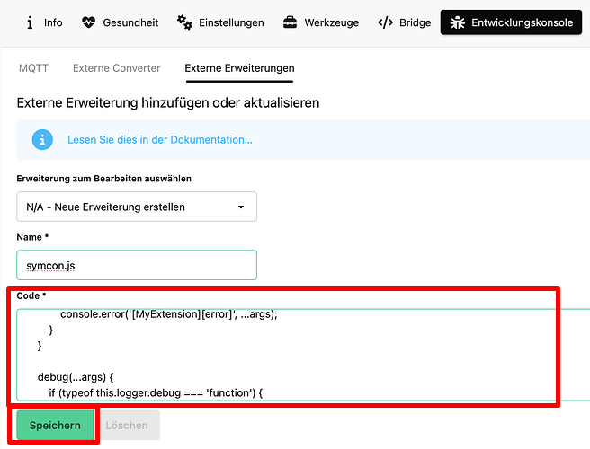
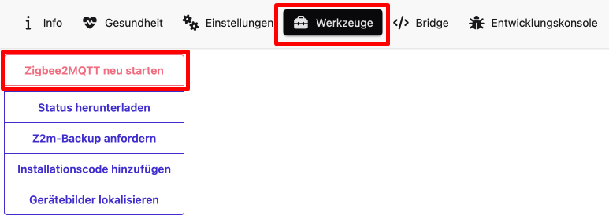

[](https://www.symcon.de/service/dokumentation/entwicklerbereich/sdk-tools/sdk-php/)
[](https://community.symcon.de/t/modul-zigbee2mqtt-version-5-x/139819)
[](https://www.symcon.de/de/service/dokumentation/installation/migrationen/v64-v70-q4-2023/)  
[](https://creativecommons.org/licenses/by-nc-sa/4.0/)
[](https://github.com/Nall-chan/Zigbee2MQTT/actions)
[](https://github.com/Nall-chan/Zigbee2MQTT/actions)  

# Zigbee2MQTT  <!-- omit in toc -->  

Anbindung von [zigbee2mqtt](https://www.zigbee2mqtt.io) an IP-Symcon.

## Inhaltsverzeichnis  <!-- omit in toc -->

- [1. Voraussetzungen](#1-voraussetzungen)
- [2. Enthaltene Module](#2-enthaltene-module)
- [3. Installation](#3-installation)
  - [3.1 Neuinstallation](#31-neuinstallation)
  - [3.2 Update von Modul Version 4.5 auf 5.x](#32-update-von-modul-version-45-auf-5x)
  - [3.3 Installation der IP-Symcon Extension in Zigbee2MQTT](#33-installation-der-ip-symcon-extension-in-zigbee2mqtt)
- [4. Konfiguration in IP-Symcon](#4-konfiguration-in-ip-symcon)
- [5. Changelog](#5-changelog)
- [6. Spenden](#6-spenden)
- [7. Lizenz](#7-lizenz)

## 1. Voraussetzungen

- mindestens IPS Version 7.0
- MQTT-Broker (interner MQTT-Server von Symcon oder externer z.B. Mosquitto)
- installiertes und lauffähiges [zigbee2mqtt](https://www.zigbee2mqtt.io) 

## 2. Enthaltene Module

- [Zigbee2MQTT Discovery](Discovery/README.md)
- [Zigbee2MQTT Konfigurator](Configurator/README.md)
- [Zigbee2MQTT Bridge](Bridge/README.md)
- [Zigbee2MQTT Gerät](Device/README.md)
- [Zigbee2MQTT Gruppe](Group/README.md)

 Details zu jedem Typ sind direkt in der Dokumentation der jeweiligen Module beschrieben.

## 3. Installation

### 3.1 Neuinstallation  

Zuerst ist eine funktionierende Zigbee2MQTT Umgebung gemäß der [Installationsanleitung von Zigbee2MQTT (Link)](https://www.zigbee2mqtt.io/guide/getting-started/) einzurichten.

Ein hierfür benötigter MQTT-Broker ist in Symcon verfügbar und muss entsprechend **vorher** [in Symcon als Instanz erstellt werden (Link)](https://www.symcon.de/de/service/dokumentation/modulreferenz/mqtt/mqtt-server/), sofern er nicht schon vorhanden ist.
Ein MQTT-Konfigurator wird für Zigbee2MQTT nicht benötigt!  

Die Installation des Zigbee2MQTT Moduls erfolgt anschließend über den Module Store in der Symcon Konsole.  
  

Nach der Installation fragt die Konsole ob eine [Zigbee2MQTT-Discovery](Discovery/README.md)-Instanz erstellt werden soll.  
  

Weitere Schritte zur Ersteinrichtung sind unter dem [Zigbee2MQTT-Discovery](Discovery/README.md)-Modul beschrieben.  

---

### 3.2 Update von Modul Version 4.5 auf 5.x

> [!IMPORTANT] WICHTIG  
> **Bitte diese Migrationsanleitung genau lesen und beachten, ein downgrade auf eine alte Modul Version ist nur mit einem Symcon-Backup möglich!**

### I. Vorbereitung <!-- omit in toc -->

- Bevor das Update über den Modul-Store durchgeführt werden kann, ist sicherzustellen das zuvor mindestens die Version 4.6 der [Extension in Zigbee2MQTT](#33-installation-der-ip-symcon-extension-in-zigbee2mqtt) installiert ist.
- Diese wird automatisch ab Version 4.5 durch die [Bridge-Instanz](Bridge/README.md)  installiert, sofern diese Instanz angelegt wurde.
- Alternativ muss die benötigte [Extension in Zigbee2MQTT](#33-installation-der-ip-symcon-extension-in-zigbee2mqtt) manuell ein Update auf Version 4.6 erhalten.

> [!CAUTION] ACHTUNG
> Ohne aktuelle Extension wird das Modul Update mit Fehlermeldungen durchgeführt, welche zu unerwarteten Fehlverhalten führen kann.

### II. Modul-Update <!-- omit in toc -->

> [!TIP]  Meldungen kontrollieren
>
> - Während des Updates wird empfohlen das Fenster [Meldungen](https://www.symcon.de/de/service/dokumentation/komponenten/verwaltungskonsole/meldungen/) geöffnet zu lassen um eventuelle Fehlermeldungen nachvollziehen zu können.  
> - Das Update anschließend über den [Modul-Store](https://www.symcon.de/de/service/dokumentation/komponenten/verwaltungskonsole/module-store/) durchführen.  

---

> [!WARNING] Vorsicht!
> **geänderte Variablen-Profile**
>
>
> - Die Variablen welche bei `Helligkeit` vorher einen Wertebereich von 0 - 254 hatten, werden auf das Profil `~Intensity.100` angepasst. Das Modul rechnet ab sofort automatisch den Wertebereich aus Z2M in Prozent um.  
> - Entsprechende Aktion auf oder Auswertungen des Rohwertes der Variablen sind zu prüfen und gglfs. anzupassen.  

---

> [!TIP] Alte Variablenprofile löschen
> Folgendes Script kann in Symcon ausgeführt werden, um veraltete Variablenprofile zu löschen.
>
> ```php
>$Z2M_Profile = array_filter(IPS_GetVariableProfileList(),function($Profil)
>{
>    return substr($Profil, 0, 4) === 'Z2M.';
>});
>
>foreach (IPS_GetVariableList() as $VariableId)
>{
>    $Variable = IPS_GetVariable($VariableId);
>    $Found = array_search($Variable['VariableProfile'],$Z2M_Profile);
>    if($Found !== false){
>        unset($Z2M_Profile[$Found]);
>    }
>}
>
>foreach ($Z2M_Profile as $Profile)
>{
>    IPS_DeleteVariableProfile($Profile);
>    echo 'Delete: '.$Profile.PHP_EOL;
>}
>```

---

> [!WARNING] geänderte Variablen-Idents
>
> - Die Version 5.0 ändert beim Update alle Ident aller Variablen welche zu einer ZigbeeMQTT-Instanz gehören.
> - Diese Änderung betrifft nur User welche mit Scripten auf Variablen per Ident (z.B. Z2M_Brightness) und nicht per ObjektID (z.B. 12345) zugreifen.
> - Die Variablen selbst bleiben dabei erhalten, so das sich hier keine ObjektIDs ändern, und entsprechend auch keine Änderungen an Ereignissen, Links, Automationen etc... ergeben.  
> 
---

> [!CAUTION] geänderte Variablentypen
>
> Folgende Liste enthält alle Variablen wo zuvor eine Variable vom falschen Typ genutzt wurde.
> Diese werden nicht migriert, sondern bleiben erhalten.
> Es werden die neuen Variablen zusätzlich angelegt, so das hier anschließend manuell z.B. Links oder Ereignisse, angepasst werden müssen.
>
> | Name                 | Ident Alt             | Type Alt | Ident Neu              | Typ neu |
> | :------------------- | :-------------------- | :------- | :--------------------- | ------- |
> | Aktion Übergangszeit | Z2M_ActionTransTime   | int      | action_transition_time | float   |
> | Aktion Transaktion   | Z2M_ActionTransaction | float    | action_transaction     | int     |
> | X Achse              | Z2M_XAxis             | float    | x_axis                 | int     |
> | Y Achse              | Z2M_YAxis             | float    | y_axis                 | int     |
> | Z Achse              | Z2M_ZAxis             | float    | Z_axis                 | int     |

### 3. Zigbee2MQTT Version <!-- omit in toc -->

- Ein Update auf Zigbee2MQTT Version 2.0 oder neuer kann nach dem Update des Moduls durchgeführt werden.  
- Hierzu sind die Anleitungen unter [zigbee2mqtt.io](https://www.zigbee2mqtt.io/guide/installation/) zu beachten.
- In Symcon sollte eine [Bridge-Instanz](Bridge/README.md) eingerichtet sein, damit beim Update automatisch die korrekte [Extension in Zigbee2MQTT](#33-installation-der-ip-symcon-extension-in-zigbee2mqtt) installiert wird.  

---

### 3.3 Installation der IP-Symcon Extension in Zigbee2MQTT

Für den fehlerfreien Betrieb des Moduls wird eine Erweiterung (Extension) in Zigbee2MQTT benötigt.

**Folgende Varianten zum Einreichten der Erweiterung sind möglich:**  

**1.** Über die [Bridge](Bridge/README.md)-Instanz in Symcon (empfohlen)  

**2.** Über das Z2M Frontend den Inhalt der passenden Datei unter dem Menüpunkt Erweiterungen hinzufügen.  

**3.** Die passende Datei in das der Z2M Version entsprechende Verzeichnis auf dem Rechner, wo Z2M installiert ist ablegen. (Expertenwissen zu Z2M erforderlich)

Extension-Dateien und Pfade innerhalb Z2M:

- **Z2M bis Version 1.42**  
  - [IPSymconExtension.js](libs/IPSymconExtension.js)
  - Z2M Pfad: **`data/extension`**
- **Z2M ab Version 2.0**  
  - [IPSymconExtension2.js](libs/IPSymconExtension2.js)
  - Z2M Pfad: **`data/external_extensions`**  

**Anleitungen zum Einrichten der Erweiterung:**  

**zu 1.** Ist in der Dokumentation der [Bridge](Bridge/README.md)-Instanz beschrieben.  

**zu 2.** Das Frontend von Z2M im Browser öffnen und den Punkt "Entwicklerkonsole" wählen.  
   Den Reiter "Externe Erweiterungen" auswählen.  
   Eine neue Erweiterung erstellen und den Namen z.B. symcon.js vergeben.  
     
   Den Inhalt (Code) aus  
   [IPSymconExtension.js für Z2M bis Version 1.42](libs/IPSymconExtension.js)  
   oder  
   [IPSymconExtension.js für Z2M ab Version 2.0](libs/IPSymconExtension2.js)  
   im Code Bereich einfügen und speichern.  
     
   Danach sollte Z2M neu gestartet werden:  
     

**zu 3.** Sollte nur von versierten Usern gemacht werden, da es aufgrund der vielzahl an Systemen unter welchen Z2M laufen kann, keine global gültige Anleitung gibt.  

## 4. Konfiguration in IP-Symcon

Bitte den einzelnen Modulen entnehmen:

- [Bridge](Bridge/README.md)
- [Configurator](Configurator/README.md)
- [Device](Device/README.md)
- [Group](Group/README.md)

## 5. Changelog  

**Version 5.34:**

- Das `&` Zeichen wird bei feature / Property zu `_and_` ersetzt.

**Version 5.33:**

- Bei composite wurde versucht für eine nicht vorhandene Hauptvariable eine Aktion zu setzen.  
- Das `&` Zeichen wird bei Profilen gefiltert.
- Readme aktualisiert.  
  
**Version 5.31:**  

- Fehlermeldung Profil Z2M.AutoLock existiert nicht behoben  
- Bridge Instanz erkennt ZH Version 6.X  
- Alle Instanzen mit einer "Occupancy"/"Bewegung" Variable unterstützen, sofern in Z2M eingerichtet, auch die "No Occupancy Since"/"Keine Bewegung seit" Variable  
- interne Modul Tests erweitert  
  
**Version 5.26:**  

- Diverse Fixes betreffend der Fehlermeldungen Undefined array key  
- Die Aktion "Helligkeit mit Übergang" war defekt  
- Geändertes Verhalten beim schalten der Farbe, basierend auf dem aktiven Farbmodus  
- Color Datenempfang um Hue / Saturation ergänzt  
- Bridge Instanz erkennt ZH Version 5.X  

**Version 5.25:**

- Erste Version als stable im Store erhältlich  
- Letzte Änderung war nun das Entfernen von Debug Meldungen aus dem Logfile  

**Version 5.22:**  

- Durch das aktiveren von Include device information in Z2M werden keine Variablen mehr in Symcon angelegt  

**Version 5.20:**  

- Diverse Übersetzungen ergänzt (Nachträglich werden diese bei Variablen nicht angepasst!)  
- Fix für Smoke Profile (~Alert)  
- Fix für Boolean Profile, wo Variablen als Boolean und Profile als String angelegt wurden  
- Dateiname des Debug Download enthält den Modelnamen  

**Version 5.19:**

- Diverse Übersetzungen ergänzt (Nachträglich werden diese bei Variablen nicht angepasst!)  
- contact, tamper Variablen erhalten korrekte Standard-Profile (~Window.Reserved bzw ~Alert)  
- Fix für color_temp_kelvin Variable  

**Version 5.18:**  

- Preset Variablen (Voreinstellungen) zeigen den zuletzt empfangenen / gesendeten Wert an  
- Übersetzungen von Profil zu Voreinstellungen geändert. (Hat keinen Einfluss auf vorhandenen Variablen)  

**Version 5.17:**  

- Das Debug Download war teilweise defekt  
  
**Version 5.16:**  

- Instanzen welche als Topic einen Anfang von anderen Topics enthielten, haben falsche Daten empfangen und verarbeitet (z.B. Topic "Flur" hat auch Daten von Topics "Flur 01", "Flur 02", "Flur hinten" verarbeitet)  
  
**Version 5.15:**  

- Erweiterung bei Update Variablen  
- Einführung der Instanz-Funktionen Z2M_WriteValueBoolean, Z2M_WriteValueInteger, Z2M_WriteValueFloat und Z2M_WriteValueString für PHP-Skripte  

**Version 5.13:**  

- Erweiterung der Variablen-Erstellung auf die ‚list‘-Exposes, welche vorher nicht beachtet wurden  
- fehlende Übersetzungen ergänzt  
- Fehler bei Discovery Instanz sollte behoben sein  

**Version 5.12:**  

- Array und Composite Variablen (z.b. Update, Level-Config usw.) sind Variablen verfügbar  

**Version 5.11:**  

- Child Lock konnte nicht geschaltet werden  
- einige Text Variablen wurden nicht angelegt (z.B. die Schedule Variablen)  
- Fehlende Übersetzungen ergänzt (werden nur beim neu Anlegen von Variablen/Profilen berücksichtigt)  
- Debug Download bei Gruppen war defekt  
- JSON Datei für fehlende Übersetzungen konnte kaputt gehen  
- Fehlende Übersetzungen werden im Debug Download einbezogen  
- Fehlende Übersetzungen können in der Instanz-Konfig angezeigt werden (nur wenn es welche gibt)  

**Version 5.10:**  

- Fix für nicht vorhandene Profile bei Text Datentypen  

**Version 5.09:**  

- Fix für 32-Bit Int zu Float Überlauf bei last_seen behoben  

**Version 5.08:**  

- diverse fixes für die Migration → einige Idents konnten nicht übertragen werden (z.B. Z2M_SmokeDensityDBM, Z2M_Window_OpenFeature, Z2M_PiHeatingDemand etc)  
- Variablen welche aufgrund eines (früher) falschen Variablentyps nicht migriert werden können, werden übersprungen  
- last_seen wird immer als integer behandelt.
- calibration_time wird immer auf float und countdown* immer auf int gemappt  
- Debug JSON um unnötige Verschachtlungen reduziert  
  
**Version 5.05:**  

- Debug Download eingeführt  
- Discovery Instanz verfügbar
- Konfigurator erkennt falsch zugeordnete MQTT-Server/Clients  

**Version 5.01:**  

- diverse Profile von float zu int umgestellt  
- Extension filtert Gruppen ohne Namen aus (vermutlich Reste aus alten Z2M Versionen)  
- Migrate hat State Variablen nicht korrekt verarbeitet  

**Version 5.00:**  

- Kompatibilität mit Zigbee2MQTT Version 2.0 hergestellt  
- Geräte erkennen automatisch die Features und Exposes und erstellen die benötigten Variablen mit den entsprechenden Profilen eigenständig  
  - Somit keine missing exposes Debugs mehr nötig!  
- Nutzung von Standard-Symcon Profilen, soweit möglich  
- Presets und Effekte als Variablen verfügbar  
- Array und Composite Variablen (z.b. Update, Level-Config usw.) sind Variablen verfügbar.
- Geräte speichern die IEEE um umbenannte Geräte (= geändertes Topic) zu erkennen
- Z2M Prefix bei VariablenIdents entfernt  
- Konfigurator übernimmt die MQTT Topic-Struktur beim Anlegen von Geräten als Kategorien  
- Konfigurator erkennt fehlende Bridge-Instanz  
- Konfigurator erkennt falsche Topics (anhand der IEEE Adresse der Geräte)  
- Bridge installiert die Extension nicht mehrfach  
- Bridge installiert automatisch die benötigte Extension  
- Komplettes Code-Rework für Geräte und Gruppen von Bruki24
- Diverse Aktionen für die Instanzen der Geräte und Gruppen:  
  - Relatives Dimmen der Helligkeit  
  - Schrittweises Dimmen der Helligkeit  
  - Relatives Dimmen der Farbtemperatur  
  - Schrittweises Dimmen der Farbtemperatur  
  - Ein-/Ausschaltverzögerung  
  
## 6. Spenden

Dieses Modul ist für die nicht kommerzielle Nutzung kostenlos, Schenkungen als Unterstützung für den Autor werden hier akzeptiert:

<a href="https://www.paypal.com/cgi-bin/webscr?cmd=_s-xclick&hosted_button_id=EK4JRP87XLSHW" target="_blank"></a> <a href="https://www.amazon.de/hz/wishlist/ls/3JVWED9SZMDPK?ref_=wl_share" target="_blank">Amazon Wunschzettel</a>

## 7. Lizenz

[CC BY-NC-SA 4.0](https://creativecommons.org/licenses/by-nc-sa/4.0/)
